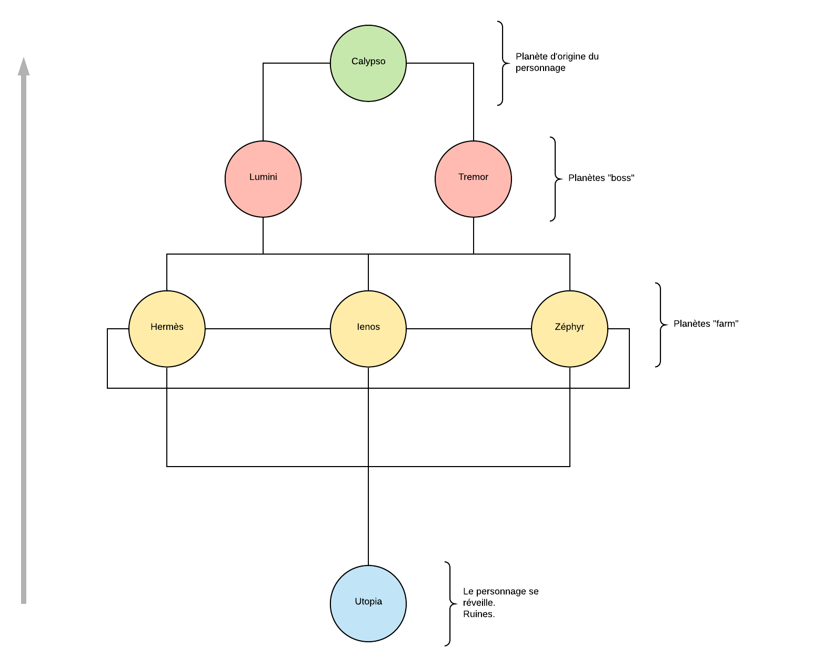

# Back Home #

> DUT Informatique (AS) - 
> IUT Nancy Charlemagne - 
> Année 2019-2020

## Scenario ##

### Général ###

Le personnage se réveille mystérieusement sur la planète Utopia, qui incarnait les idéaux de l'humanité, à travers notamment son développement technologique. Ne sachant pas combien de temps il est resté inconscient, le personnage découvre un monde en ruine, où la majeure partie de l'humanité a disparu, à l'exception de rodeurs et de factions.

Le personnage est né sur cette planète, suite à l'exode de ses parents, originaires de la planète Calypso. La seule perspective qui s'offre alors au personnage est d'explorer les alentours pour trouver un moyen de quitter Utopia et rejoindre Calypso pour remonter à ses origines et retrouver une trace de la société.

Le personnage va donc devoir entamer un voyage pour retrouver Calypso, à travers de nécessaires détours par des planètes plus ou moins hospitalières...

## Conception / Gameplay ##

### Fonctionnalités, phases de jeu ###

