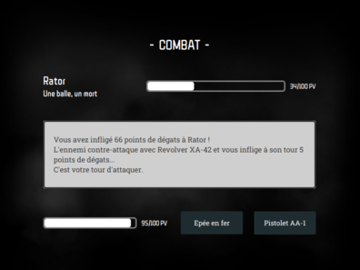
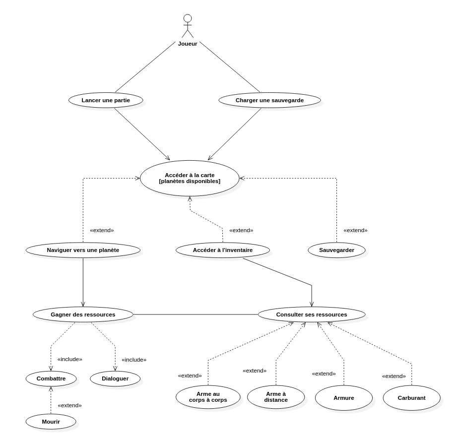

# BackHome

*Mini-jeu réalisé dans le cadre du DUT informatique A.S. 2019-2020 - IUT Nancy Charlemagne.*

**Participants au projet :** Clément Dosda, Louis Friedrich, Tony Martin, Quoc-Hieu Phu, Loïc Steinmetz.

- [1. Général](#markdown-header-1-general)
    - [1.1 Lancer le jeu](#markdown-header-11-lancer-le-jeu)
    - [1.2 Scénario](#markdown-header-12-scenario)
    - [1.3 Gameplay](#markdown-header-13-gameplay)
- [2. Conception](#markdown-header-2-conception)
    - [2.1 Adaptation du pattern MVC](#markdown-header-21-adaptation-du-pattern-mvc)
    - [2.2 Structure applicative](#markdown-header-22-structure-applicative)
    - [2.3 Gestion des données](#markdown-header-23-gestion-des-donnees)
- [3. Bilan](#markdown-header-3-bilan)


## 1. Général

### 1.1 Lancer le jeu

**Exécution simple :**

Un export du jeu, sous la forme d'un fichier image, directement exécutable sous linux, est disponible dans l'onglet [Downloads](https://bitbucket.org/b4va/projet_jeu_iutnc/downloads/) du repository.

**Exécution dans un environnement de développement :**

L'exécution de l'application nécessite l'intégration de JavaFx aux modules d'exécution, soit via Java 8 qui les intègre nativement, soit via un ajout manuel.

Pour un ajout manuel, télécharger JavaFx et ajouter une option à la VM : 

```
--module-path %PATH_TO_FX% --add-modules=javafx.controls
```

Le projet a été développé sur Intellij et Eclipse et contient donc les fichiers de configurations propres à ces IDE, le rendant plus directement exploitable sur ces derniers.

### 1.2 Scénario

Le héros se réveille mystérieusement sur la planète Utopia, qui incarnait les idéaux de l'humanité, à travers notamment son développement technologique. Il n'est pourtant pas originaire de cette planète. Ne sachant pas combien de temps il est resté inconscient, le personnage découvre un monde en ruine, où la majeure partie de l'humanité a disparu, à l'exception de rodeurs et de factions.

Il faudra donc entamer un voyage pour retrouver Calypso, la planète d'origine du héros, à travers de nécessaires détours par des planètes plus ou moins hospitalières...

Toutes les planètes ne sont pas disponibles au début du jeu. Il faudra réunir d'abord les ressources nécessaires pour y accéder.


### 1.3 Gameplay

Le jeu propose principalement deux phases de gameplay :

- La navigation : Vous êtes à bord du vaisseau. Vous devez choisir la prochaîne planète à visiter, en prenant en compte vos ressources. Ces ressources peuvent être consultées dans un menu d'inventaire.
- Les événements : Vous atterissez sur une planète, et êtes confrontés à différentes situations. Vous devrez réaliser des choix entre différentes options et affronter des ennemis, pour collecter des récompenses et avancer dans la quête.




L'interface centrale du jeu est celle du vaisseau, qui fait office de carte et plus globalement de menu principal. Cette interface permet d'afficher les planètes disponibles et/ou accessibles et de s'y rendre, mais aussi d'afficher l'inventaire et de sauvegarder la partie.



## 2. Conception

### 2.1 Adaptation du pattern MVC

La structure de l'application repose sur les fonctionnalités de JavaFx. Les différentes classes java sont donc réparties en différents packages, selon le pattern MVC (Model, View, Controller), d'après leur usage fonctionnel.

- Le package `app` inclut la classe exécutable du programme.
- Le dossier `assets` regroupe les différentes ressources du programme : images, polices, feuilles de style.
- Le package `controllers` regroupe les différents controleurs appelés au cours de l'exécution et permettant d'interagir avec la vue proposée à l'utilisateur.
- Le dossier `data` regroupe les fichiers de stockage au format `json`, servant à la configuration des modèles.
- Le package `lib` regroupe les librairies externes utiles au projet.
- Le package `models` regroupe les différents modèles mobilisés par l'application, soit la modélisation concrète des différents objets manipulés.
- Le package `tests` regroupe les classes de test.
- Le package `utils` regroupe des classes utilitaires, dont les méthodes sont mobilisées à différents endroits.
- Le package `views` regroupe les différentes vues au format `fxml`, qui structurent l'interface utilisateur ainsi que la classe `View` permettant le lancement de ces dernières.

Ci-dessous, la présentation d'une séquence type du fonctionnement de l'application.


Déroulement de la séquence :

```
1.  Démarrage de la vue suite au démarrage du programme ou via un événement, déclenché par une saisie utilisateur
2.  La vue initialise le controleur qui lui est associé
3.  Au cours de son initialisation, le controleur fait une requête au modèle auquel il est associé afin de récupérer dynamiquement certaines informations
4.  Les données lui sont retournées
5.  Le controleur formate la vue d'après les informations récupérées
6.  La vue finale est présentée à l'utilisateur

Pour chaque input utilisateur, via un élément de l'interface :
7.  L'utilisateur génère un événement via une saisie
8.  La vue envoie l'événement généré au controleur et déclenche son traitement
9.  Au cours du traitement de l'événement, le controleur fait une requête au modèle auquel il est associé afin de récupérer dynamiquement certaines informations
10. Les données lui sont retournées
11. Le controleur met à jour la vue d'après les informations récupérées
12. La vue mise à jour est présentée à l'utilisateur

Pour un input impliquant le passage à une vue différente
14. L'utilisateur génère un événement via une saisie
15. La vue envoie l'événement généré au controleur et déclenche son traitement
16. Le controleur actif démarre une nouvelle vue
17. [Nouvelle séquence à partir de la vue]
```

### 2.2 Structure applicative

Outre la division fonctionnelle des différentes classes du programme, répercutée dans leur répartition en différents packages, on peut également diviser le projet en différents groupes de classes répondant d'une même fonction logique. Ces structures sont visibles à travers les conventions de nommage du projet ; modèle, vue et controleur d'une même structure sont nommées de la façon suivante :

- Model
- Model.fxml *via ModelView, classe privée de View*
- ModelController


**Accueil/Conclusion du jeu :**

- **Modèle** : BackHome
- **Vue** : BackHome.fxml *via BackHomeView, classe privée de View*
- **Controleur** : BackHomeController

Gèrent les options disponibles au lancement du jeu (nouvelle partie et chargement d'une sauvegarde). Gèrent également l'affichage de conclusion du jeu, en fin de partie, avant un retour à l'écran d'accueil.

**Navigation :**

- **Modèle** : Carte
- **Vue** : Carte.fxml *via CarteView, classe privée de View*
- **Controleur** : CarteController

Gèrent les options disponibles à bord du vaisseau, soit l'accès aux différentes planètes disponibles, l'accès à l'inventaire et l'enregistrement d'une sauvegarde.

**Inventaire :**

- **Modèle** : Inventaire
- **Vue** : Inventaire.fxml *via InventaireView, classe privée de View*
- **Controleur** : InventaireController

Gèrent l'affichage de la composition de l'inventaire (armes, armure, carburant) et le retour à l'interface de navigation.

**Quête et événements :**

- **Modèle** : Quete
- **Vue** : Quete.fxml *via QueteView, classe privée de View*
- **Controleur** : QueteController

Gèrent l'affichage de l'arrivée sur une nouvelle planète et/ou la redirection vers la vue approprié, en fonction du type d'événement à venir.

L'accès à la vue de quête peut en effet donner lieu à une redirection en fonction de la situation du héros :


```
DECRIRE FONCTIONNEMENT
```

**Combats :**

- **Modèle** : Combat
- **Vue** : Combat.fxml *via CombatView, classe privée de View*
- **Controleur** : CombatController

Gèrent le déroulement d'un combat : scénario introductif, lancement, phases d'attaque et de contre-attaque, et conclusion en fonction de l'issue du combat. Permettent d'enregistrer le prochain événement en fonction de l'issue, événement qui sera alors traité par le QueteController.

Les combats sont construits en prenant en compte les armes et l'armure du héros, ainsi que le type d'ennemi :


```
DECRIRE FONCTIONNEMENT
```

**Prises de décisions :**

- **Modèle** : Decision
- **Vue** : Decision.fxml *via DecisionView, classe privée de View*
- **Controleur** : DecisionController

Gèrent le déroulement d'une prise de décision : scénario introductif, choix d'une option. Permettent d'enregistrer le prochain événement en fonction du choix réalisé, événement qui sera alors traité par le QueteController. Les décisions peuvent proposer 2, 1 ou 0 choix. Dans le premier cas, la suite des événement tiendra compte du choix du joueur. Le second cas sert à mettre en évidence une information ou une action du héros au moyen d'une validation de la part du joueur. Le dernier cas servira enfin à un simple affichage d'une partie du scénario.

**Sauvegarde :**

- **Modèle** : Sauvegarde
- **Vue** : Sauvegarde.fxml *via SauvegardeView, classe privée de View*
- **Controleur** : SauvegardeController

Gèrent le chargement et l'enregistrement d'une sauvegarde. Permettent également l'accès à une interface de gestion des sauvegardes, disponible depuis l'accueil du jeu et permettant à l'utilisateur de charger et supprimer les sauvegardes disponibles.

### 2.3 Gestion des données

Les données de configuration, persistantes entre différentes exécutions de l'application, sont stockées dans des fichiers au format `json`. Ces fichiers sont parsés au cours de l'exécution des différents programmes de l'application. Ils servent alors à l'initialisation de différents modèles qui implémentent, dans cette perspective, l'interface `Configurable`, et renvoient à un fichier `json` portant le même nom.

La persistance des données entre différentes séquences, une fois l'application exécutée, est quant à elle permise par certains modèles étant construit comme des singletons. Ces modèles sont les suivants :

- Heros
- Inventaire
- Carte
- Quete

La gestion des sauvegardes donne lieu à la création d'un fichier de stockage externe au format `json`, permettant cinq enregistrements. Quatre sauvegardes sont initialement enregistrées au premier démarrage du jeu :

- **Utopia** : Premier accès au vaisseau, après passage de la première planète.
- **Ienos** : Accès possible aux planètes de niveau 2, après avoir passé les quatre premières planètes de niveau 1.
- **Lumini** : Accès possible à la dernière planète, via Lumini.
- **Tremor** : Accès possible à la dernière planète, via Tremor.

## 3. Bilan

Plusieurs difficultés ont été rencontrées au cours du développement, nous amenant à réfléchir à certaines solutions pour des projets futurs :

- **Conception** : Ce projet consituait pour nous une première utilisation des fonctionnalités JavaFx. Il a donc été assez long de maîtriser leurs différents aspects techniques, et de les implémenter de façon claire et rigoureuse. L'implémentation de JavaFx suivant le pattern M.V.C. a ainsi été particulèrement compliquée à mettre en oeuvre, nécessitant plusieurs itérations. Les problèmes rencontrés lors de cette implémentation ont cependant conduit à une recherche approfondie quant aux standards en la matière et nous ont permis de travailler plus avant notre conception du programme.
- **Gestion des données** : 
    - *Fichiers de stockage* : Le format `json`, retenu pour le stockage des données persistantes, a été privilégié en tenant compte de nos connaissances préalables. Il s'est avéré que ce format n'est pas nécessairement le plus adapté à des traitements en Java. Nous en avons conclu qu'il aurait été préférable de stocker les données dans des fichiers au format `xml`.
    - *Modélisation, normalisation* : Faute de temps, nous avons du concevoir notre organisation des données au fil du développement, sans conduire une réelle réflexion sur leur structure. Cela nous a permis de comprendre davantage l'importance d'une modélisation réfléchie du système de données, devant être réalisée en amont.
- **Tests** : Faute de temps encore une fois, les tests ont du être réalisés à la suite du développement proprement dit de l'application, et ce en nombre réduit. Cela nous a donc privé de tests d'intégration au cours du développement, tests qui auraient été utiles pour valider l'implémentation de nouvelles fonctionnalité, au fur et à mesure que nous réalisions de nouvelles itérations du projet. Dans l'idéal, et si nous avions eut plus de temps, nous avons conclu sur l'intérêt des TDD (*Test Driven Development*) pour la conduite de projets futurs.
- **Game Design** : Concentrés sur l'aspect technique de la réalisation du jeu, nous avons ignoré, au moins partiellement, de nombreux aspects de game design. Ainsi l'équilibrage, le level design etc. pourraient être revus.
- **Gestion de projet** :
    - *Trello* : L'utilisation de Trello a été un gros plus pour la gestion de projet et les fonctionnalités de l'outils ont été progressivement utilisées.
    - *Git* : Tous les participants au projet n'étant pas familiers de Git, il nous aura fallu quelques temps pour la mise en place. L'outil nous a néanmoins rapidement permis de travailler collectivement.

En dépit des difficultés, nous avons finalement su être suffisament organisés et impliqués pour livrer, nous semble-t-il, un jeu convainquant, fonctionnel et conforme à nos attentes de départ. Ainsi, nous avons pu mener ce projet à terme et sommes satisfait du résultats compte tenu des contraintes, notamment de temps et d'organisation, qui se sont imposées à nous.