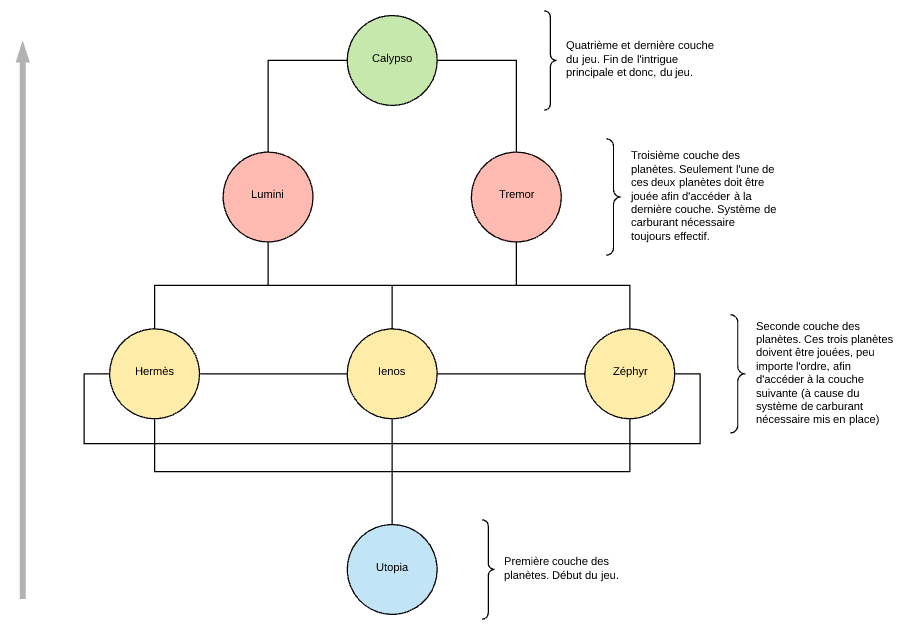
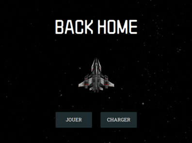
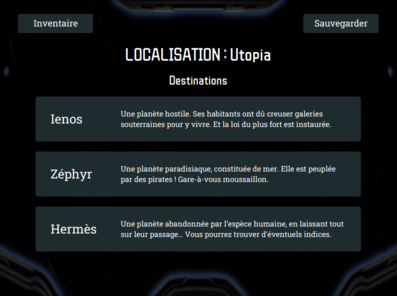
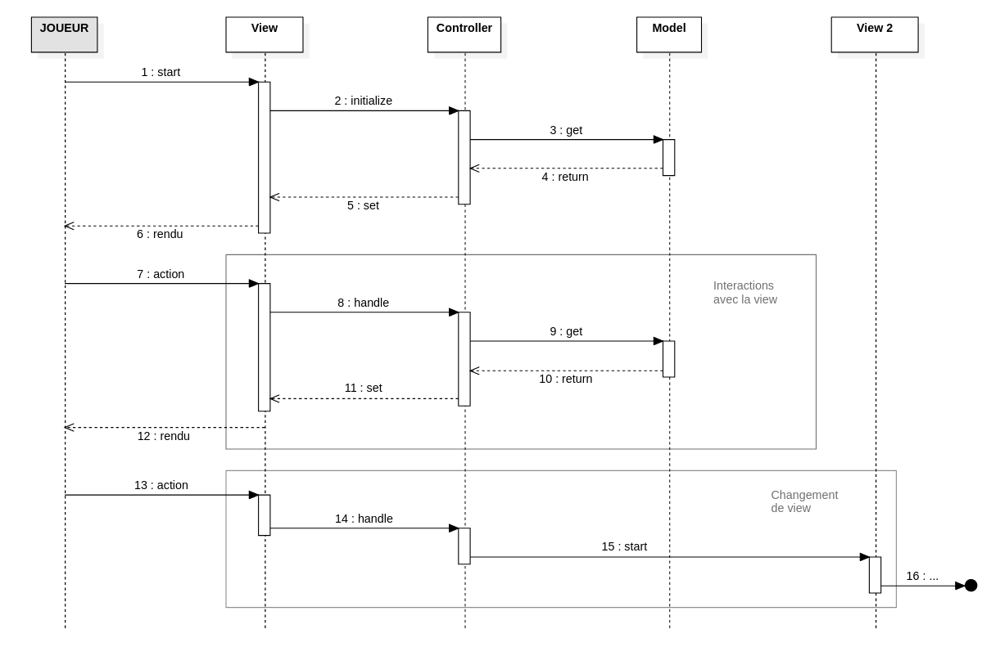
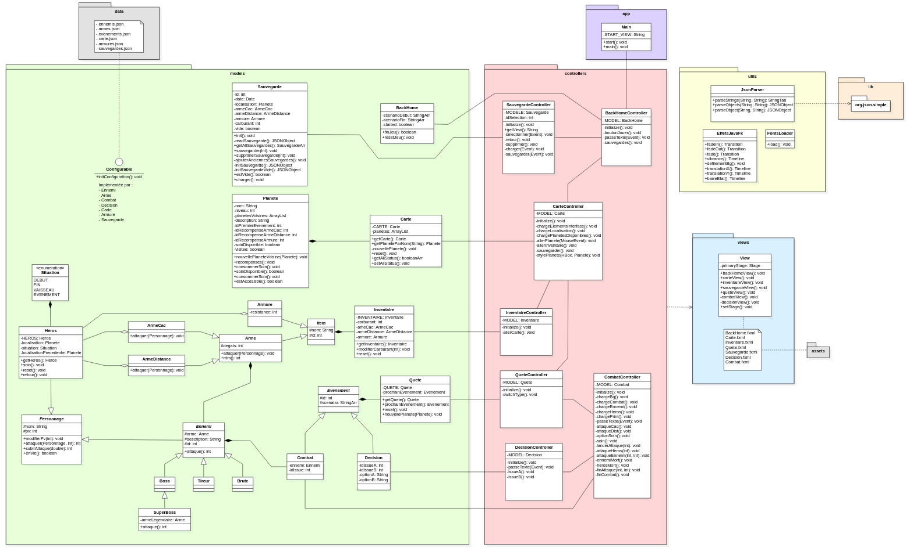

# BackHome

Mini-jeu réalisé dans le cadre du DUT informatique A.S. 2019-2020 - IUT Nancy Charlemagne. 

**Participants au projet :** Clément Dosda, Louis Friedrich, Tony Martin, Quoc-Hieu Phu, Loïc Steinmetz.

- [1. Général](#1)
    - [1.1 Lancer le jeu](#1.1)
    - [1.2 Scénario](#1.2)
    - [1.3 Gameplay](#1.3)
- [2. Conception](#2)
    - [2.1 Adaptation du pattern MVC](#2.1)
    - [2.2 Structure applicative](#2.2)
    - [2.3 Gestion des données](#2.3)
- [3. Bilan](#3)


## 1. Général

<a name="1"></a>

### 1.1 Lancer le jeu

<a name="1.1"></a>

**Exécution simple :**

Des exports exécutables du jeu sont disponibles dans l'onglet [Downloads](https://bitbucket.org/b4va/projet_jeu_iutnc/downloads/) du repository. Les extensions disponibles sont les suivantes : `.deb`, `.exe`, AppImage.

**Exécution dans un environnement de développement :**

L'exécution de l'application nécessite l'intégration de JavaFx aux modules d'exécution, soit via Java 8 qui les intègre nativement, soit via un ajout manuel.

Pour un ajout manuel, télécharger JavaFx et ajouter une option à la VM : 

```
--module-path %PATH_TO_FX% --add-modules=javafx.controls
```

Le projet a été développé sur Intellij et Eclipse et contient donc les fichiers de configurations propres à ces IDE, le rendant plus directement exploitable sur ces derniers.

### 1.2 Scénario

<a name="1.2"></a>

Le héros se réveille mystérieusement sur la planète Utopia, qui incarnait les idéaux de l'humanité, à travers notamment son développement technologique. Il n'est pourtant pas originaire de cette planète. Ne sachant pas combien de temps il est resté inconscient, le personnage découvre un monde en ruine, où la majeure partie de l'humanité a disparu, à l'exception de rodeurs et de factions.

Il faudra donc entamer un voyage pour retrouver Calypso, la planète d'origine du héros, à travers de nécessaires détours par des planètes plus ou moins hospitalières...

Toutes les planètes ne sont pas disponibles au début du jeu. Il faudra réunir d'abord les ressources nécessaires pour y accéder.



### 1.3 Gameplay

<a name="1.3"></a>

Le jeu propose principalement deux phases de gameplay :

- La navigation : Vous êtes à bord du vaisseau. Vous devez choisir la prochaîne planète à visiter, en prenant en compte vos ressources. Ces ressources peuvent être consultée dans un menu d'inventaire.
- Les événements : Vous atterissez sur une planète, et êtes confrontés à différentes situations. Vous devrez réaliser des choix entre différentes options et affronter des ennemis.




## 2. Conception

<a name="2"></a>

### 2.1 Adaptation du pattern MVC

<a name="2.1"></a>

La structure de l'application repose sur les fonctionnalités de JavaFx. Les différentes classes java sont donc réparties en différents packages, selon le pattern MVC (Model, View, Controller), d'après leur usage fonctionnel.

- Le package `models` regroupe les différents modèles mobilisés par l'application, soit la modélisation concrète des différents objets manipulés.
- Le package `controllers` regroupe les différents controleurs appelés au cours de l'exécution et permettant d'interagir avec la vue proposée à l'utilisateur.
- Le package `views` regroupe les différentes views au format `fxml`, qui structurent l'interface utilisateur et qui sont initialisées et mises à jour par le controller.
- Le package `data` regroupe les fichiers de stockage au format `json`, servant notamment à la configuration des modèles.
- Le package `utils` regroupe des classes utilitaires, dont les méthodes sont mobilisées à différents endroits.
- Le package `lib` regroupe les librairies externes utiles au projet.

Ci-dessous, la présentation d'une séquence type du fonctionnement de l'application.



Déroulement de la séquence :

```
1.  Démarrage du controleur suite au démarrage du programme ou via un événement, déclenché par un input utilisateur
2.  Le controleur charge la vue qui lui est associée
3.  La view lance l'initialisation du controleur en retour
4.  Au cours de son initialisation, le controleur fait une requête au modèle auquel il est associé afin de récupérer dynamiquement certaines informations
5.  Les données lui sont retournées
6.  Le controleur formate la vue d'après les informations récupérées
7.  La vue finale est présentée à l'utilisateur

Pour chaque input utilisateur, via un élément de l'interface :
8.  L'utilisateur génère un événement via un input
9.  La vue envoie l'événement généré au controleur
10. Au cours du traitement de l'événement, le controleur fait une requête au modèle auquel il est associé afin de récupérer dynamiquement certaines informations
11. Les données lui sont retournées
12. Le controleur met à jour la vue d'après les informations récupérées
13. Une nouvelle vue est présentée à l'utilisateur

Pour un input impliquant le passage à une vue différente
14. L'utilisateur génère un événement via un input
15. La vue envoie l'événement généré au controleur
16. Le controleur actif démarre un nouveau controleur
17. [Nouvelle séquence à partir du nouveau controleur]
```

### 2.2 Structure applicative

<a name="2.2"></a>

Outre la division fonctionnelles des différentes classes du programme, répercutée dans leur répartition en différents packages, on peut également diviser le projet en différents groupes de classes répondant d'une même fonction utilisateur. Ces structures sont visibles à travers les conventions de nommage du projet ; modèle, vue et controleur d'une même structure sont nommées de la façon suivante :

- Model
- Model.fxml
- ModelController



**Accueil/Conclusion du jeu :**

- Modèle : BackHome
- Vue : BackHome.fxml
- Controleur : BackHomeController

Gèrent les options disponibles au lancement du jeu (nouvelle partie et chargement d'une sauvegarde). Gèrent également l'affichage de conclusion du jeu, en fin de partie, avant un retour à l'écran d'accueil.

**Navigation :**

- Modèle : Carte
- Vue : Carte.fxml
- Controleur : CarteController

Gèrent les options disponibles à bord du vaisseau, soit l'accès aux différentes planètes disponibles, l'accès à l'inventaire et l'enregistrement d'une sauvegarde.

**Inventaire :**

- Modèle : Inventaire
- Vue : Inventaire.fxml
- Controleur : InventaireController

Gèrent l'affichage de la composition de l'inventaire (armes, armure, carburant) et le retour à l'interface de navigation.

**Quête et événements :**

- Modèle : Quete
- Vue : Quete.fxml
- Controleur : QueteController


Gèrent l'affichage de l'arrivée sur une nouvelle planète et la redirection vers le controleur approprié, en fonction du type d'événement à venir.

**Combats :**

- Modèle : Combat
- Vue : Combat.fxml
- Controleur : CombatController


Gèrent le déroulement d'un combat : scénario introductif, lancement, phases d'attaque et de contre-attaque, et conclusion en fonction de l'issue du combat. Permettent d'enregistrer le prochain événement en fonction de l'issue, événement qui sera alors traité par le QueteController.

**Prises de décisions :**

- Modèle : Decision
- Vue : Decision.fxml
- Controleur : DecisionController

Gèrent le déroulement d'une prise de décision : scénario introductif, choix d'une option. Permettent d'enregistrer le prochain événement en fonction du choix réalisé, événement qui sera alors traité par le QueteController. Les décisions peuvent proposer 2, 1 ou 0 choix. Dans le premier cas, la suite des événement tiendra compte du choix du joueur. Le second cas sert à mettre en évidence une information ou une action du héros au moyen d'une validation de la part du joueur. Le dernier cas servira enfin à un simple affichage d'une partie du scénario.

**Sauvegarde :**

- Modèle : Sauvegarde
- Vue : Sauvegarde.fxml
- Controleur : SauvegardeController
Diagramme d'état QueteController

Gèrent le chargement et l'enregistrement d'une sauvegarde. Permettent également l'accès à une interface de gestion des sauvegardes, disponible depuis l'accueil du jeu et permettant à l'utilisateur de charger et supprimer les sauvegardes disponibles.

### 2.3 Gestion des données

<a name="2.3"></a>

Les données de configuration et de sauvegarde, persistante entre différentes exécutions de l'application, sont stockées dans des fichiers au format `json`. Ces fichiers sont parsés au cours de l'exécution des différents programmes de l'application. Ils servent alors à l'initialisation de différents modèles qui implémentent, dans cette perspective, l'interface Configurable, et renvoient à un fichier `json` portant le même nom.

La persistance des données entre différentes séquences, une fois l'application exécutée, est quant à elle permise par certains modèles étant construit comme des singletons. Ces modèles sont les suivants :

- Heros
- Inventaire
- Carte
- Quete

## 3. Bilan

<a name="3"></a>